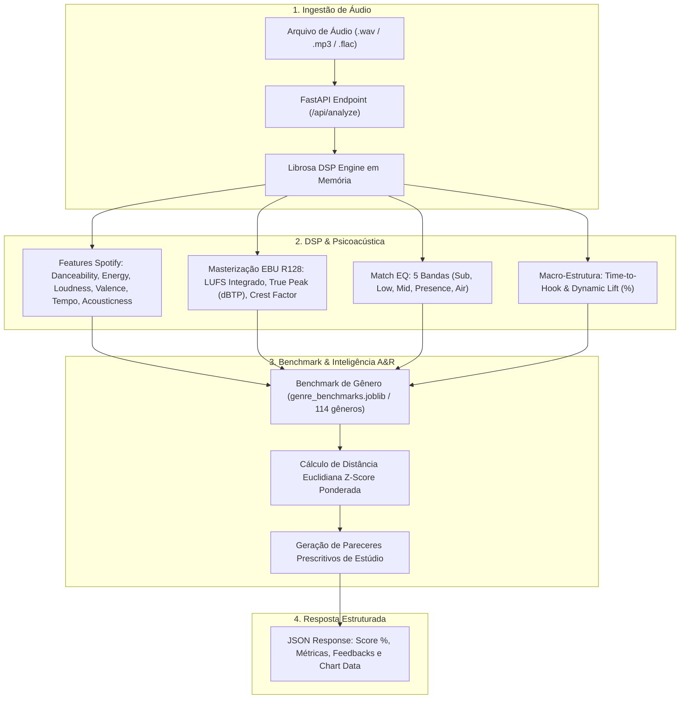

# 🎧 HitPredictor & A&R Analytics — Spotify Nano Challenge (TIC IA)
> **Copiloto de Inteligência de Mercado, Processamento Digital de Sinais (DSP), Masterização EBU R128 e Machine Learning Explicável (XAI) para Artistas Independentes e Produtores.**

[](https://python.org)
[](https://fastapi.tiangolo.com)
[](https://librosa.org)
[](https://scikit-learn.org)
[](https://shap.readthedocs.io)

---

## 👥 Equipe & Autoria
* **Ingrid Soares** ([@ingriddcg](https://github.com/ingriddcg)) — Engenharia de Áudio, Psicoacústica, Master Notebook e Pesquisa Avançada em MIR
* **Yan Santos Rodrigues** ([@yanrdgs-dev](https://github.com/yanrdgs-dev)) — Arquitetura de Software, FastAPI Backend e Estruturação de Benchmarks
* **Felipe** — Engenharia de Dados, Modelagem Preditiva e Validação Estatística

---

## 📌 Visão Geral do Projeto

Na indústria fonográfica tradicional, grandes gravadoras utilizam departamentos de **A&R (*Artists & Repertoire*)** com equipes dedicadas para avaliar o potencial de faixas antes do lançamento. Artistas independentes e pequenos selos, por outro lado, lançam suas músicas sem qualquer diagnóstico técnico de adequação acústica ao mercado.

O **HitPredictor & A&R Analytics** resolve essa assimetria permitindo que criadores façam o upload de arquivos de áudio não lançados (`.wav`, `.mp3`, `.flac`) e recebam:
1. **Alinhamento Técnico ao Gênero (Z-Score & Percentis):** Comparação multivariada ponderada contra os sucessos ($P90$) do gênero escolhido entre 114 categorias musicais.
2. **Engenharia de Masterização e Psicoacústica (EBU R128):** Medição de **LUFS Integrado** (calibração para o padrão Spotify de **-14 LUFS**), **True Peak (dBTP)**, **Crest Factor (Micro-dinâmica)** e **Balanço Tonal em 5 Bandas (Match EQ)**.
3. **Análise de Macro-Estrutura Temporal:** Segmentação da dinâmica e medição do **Tempo até o 1º Refrão (*Time-to-Hook*)**, fator crítico para reduzir a taxa de rejeição (*skip rate*).
4. **Classificador de Potencial ($P90$):** Modelo de Machine Learning (`RandomForestClassifier`) blindado contra *data leakage* via `StratifiedGroupKFold` agrupado por `track_id`.
5. **Diagnóstico Prescritivo (XAI):** Interpretabilidade via **SHAP Values (*TreeExplainer*)** com pareceres acionáveis para mixagem e arranjo.

---

## 🏗️ Arquitetura do Sistema



---

## 📂 Estrutura do Repositório

```bash
spotify-nano-challenge-TIC-IA/
├── artifacts/
│   └── genre_benchmarks.joblib       # Benchmarks estatísticos pré-computados (114 gêneros)
├── data/
│   ├── dataset.csv                   # Base original do Spotify (114.000 faixas)
│   └── dataset_limpo.csv             # Base sanitizada e deduplicada
├── docs/                             # Relatórios técnicos, artigos e diagramas
│   ├── images/                       # Imagens de arquitetura e métricas
│   ├── relatorio_tecnico_consolidado.md
│   ├── relatorio_audio_ingrid_felipe.md
│   ├── relatorio_investigacao_avancada_audio_ingrid.md
│   ├── modulo_audio.md
│   └── pesquisa_audio.md
├── notebooks/
│   └── HitPredictor_Audio_Analytics_Master.ipynb  # Master Notebook fim a fim (ML, DSP, SHAP, What-If)
├── src/
│   └── spotify_nano_challenge_tic_ia/
│       ├── app/
│       │   ├── routes/
│       │   │   └── analyze.py        # Endpoints REST (/api/analyze, /api/genres, /api/health)
│       │   ├── analysis.py           # Motor de Z-Score, ponderação e feedbacks A&R
│       │   ├── audio_dsp.py          # Extração DSP, EBU R128, True Peak, Match EQ e Hook
│       │   ├── main.py               # Instanciação FastAPI, CORS e lifecycle
│       │   └── schemas.py            # Schemas Pydantic tipados
│       └── scripts/
│           ├── build_benchmarks.py   # Script de geração dos benchmarks joblib
│           └── clean_dataset.py      # Script de limpeza e sanitização do dataset
├── pyproject.toml                    # Configuração de dependências e build UV
├── uv.lock                           # Lockfile determinístico de pacotes
└── README.md                         # Documentação principal
```

---

## 🚀 Como Executar o Backend (API FastAPI)

### 1. Pré-requisitos
* Python 3.10+ (ou [uv](https://docs.astral.sh/uv/))

### 2. Execução Direta via Ambiente Virtual (`.venv`)
```bash
# Iniciar o servidor FastAPI com hot-reload diretamente pelo ambiente virtual:
.venv/bin/uvicorn src.spotify_nano_challenge_tic_ia.app.main:app --reload --port 8000
```

### 3. Ou Ativando o Ambiente Virtual (`source`)
```bash
# Ativar o ambiente virtual e rodar
source .venv/bin/activate
uvicorn src.spotify_nano_challenge_tic_ia.app.main:app --reload --port 8000
```

### 4. Execução com `uv` (Opcional)
```bash
uv run uvicorn src.spotify_nano_challenge_tic_ia.app.main:app --reload --port 8000
```

### 5. Documentação Interativa da API (Swagger UI)
Acesse no seu navegador: **`http://localhost:8000/docs`**

---

## 🔌 Endpoints da API

### `POST /api/analyze`
Recebe um arquivo de áudio e o gênero musical de referência, retornando o score de alinhamento, métricas físicas, masterização e diretrizes de A&R.

#### Exemplo com `curl`:
```bash
curl -X POST "http://localhost:8000/api/analyze" \
  -F "file=@sua_musica.mp3" \
  -F "genre=rock"
```

#### Exemplo de Resposta JSON:
```json
{
  "filename": "sua_musica.mp3",
  "genre": "rock",
  "genre_alignment_score": 78.4,
  "metrics": {
    "danceability": 0.523,
    "energy": 0.842,
    "loudness": -6.45,
    "acousticness": 0.045,
    "valence": 0.412,
    "tempo": 126.50
  },
  "benchmark_means": {
    "danceability": 0.518,
    "energy": 0.732,
    "loudness": -7.12,
    "acousticness": 0.124,
    "valence": 0.503,
    "tempo": 124.80
  },
  "feedbacks": [
    {
      "dimensao": "Ritmo & Flow",
      "status": "Alinhado ao Gênero",
      "mensagem": "O balanço rítmico está perfeitamente alinhado ao gênero."
    },
    {
      "dimensao": "Masterização (LUFS)",
      "status": "Calibrado",
      "mensagem": "Loudness integrado (-13.6 LUFS) perfeitamente alinhado com o alvo de streaming (-14 LUFS)."
    },
    {
      "dimensao": "True Peak (dBTP)",
      "status": "Alerta de Clipping",
      "mensagem": "True Peak em 0.33 dBTP. Risco de distorção inter-amostral na conversão lossy do streaming. Recomendado teto <= -1.0 dBTP."
    },
    {
      "dimensao": "Estrutura (Hook)",
      "status": "Refrão Tardio",
      "mensagem": "O primeiro refrão surge aos 200.7s. Considere reduzir a introdução para reter ouvintes antes dos 45s."
    }
  ],
  "chart_data": {
    "labels": [
      "Ritmo (Dançabilidade)",
      "Pressão (Energia)",
      "Clima (Valência)"
    ],
    "user_values": [
      52.3,
      84.2,
      41.2
    ],
    "genre_values": [
      51.8,
      73.2,
      50.3
    ]
  },
  "mastering": {
    "integrated_lufs": -13.6,
    "true_peak_dbtp": 0.33,
    "crest_factor_db": 13.3,
    "lra_db": 7.8,
    "spotify_gain_change_db": -0.4,
    "band_energies": {
      "Sub (20-60Hz)": 26.7,
      "Low (60-250Hz)": 33.5,
      "Mid (250-2.5kHz)": 36.7,
      "Presence (2.5-7kHz)": 2.7,
      "Air (7-20kHz)": 0.2
    }
  },
  "macro_structure": {
    "duration_s": 276.0,
    "time_to_hook_s": 200.7,
    "dynamic_lift_pct": 190.7
  },
  "spectral_eq": {
    "frequencies_hz": [25, 31.5, 40, 50, 63, 80, 100, 125, 160, 200, 250, 315, 400, 500, 630, 800, 1000, 1250, 1600, 2000, 2500, 3150, 4000, 5000, 6300, 8000, 10000, 12500, 16000],
    "user_spectrum_db": [-18.5, -12.4, -6.2, -1.5, 0.0, -2.4, -3.8, -5.2, -7.1, -9.4, -12.1, -14.5, -16.2, -18.0, -20.1, -22.5, -24.8, -27.2, -29.5, -31.8, -34.2, -36.5, -39.0, -42.1, -45.5, -49.0, -53.2, -58.0, -64.1],
    "target_curve_db": [-5.8, -5.4, -5.0, -4.5, -3.9, -3.0, -2.0, -2.9, -3.9, -4.8, -5.7, -6.6, -7.6, -8.5, -9.4, -10.4, -11.3, -12.2, -13.2, -14.1, -15.0, -16.0, -16.9, -17.8, -18.8, -19.7, -20.6, -21.6, -22.5],
    "suggested_eq_gain_db": [6.0, 6.0, 1.2, -3.0, -3.9, -0.6, 1.8, 2.3, 3.2, 4.6, 6.0, 6.0, 6.0, 6.0, 6.0, 6.0, 6.0, 6.0, 6.0, 6.0, 6.0, 6.0, 6.0, 6.0, 6.0, 6.0, 6.0, 6.0, 6.0],
    "mudness_detected": false,
    "harshness_detected": false,
    "air_boost_recommended": true,
    "sub_mono_clean": true,
    "tuning_hz": 440.0
  }
}
```

---

## 📓 Master Notebook de Machine Learning & Áudio

O projeto conta com o notebook executável fim a fim:  
📁 **[`notebooks/HitPredictor_Audio_Analytics_Master.ipynb`](./notebooks/HitPredictor_Audio_Analytics_Master.ipynb)**

* **Seções Incluídas:**
  1. Setup & Estilização Dark Theme
  2. Sanitização, Limpeza e `StratifiedGroupKFold` (*Anti-Leakage*)
  3. Treinamento Random Forest + Detecção de Outliers (`IsolationForest`)
  4. Curvas **Precision-Recall (PR-AUC)**, **Spearman Rank Correlation** e **Brier Score**
  5. Interpretabilidade Global e Local com **SHAP Values (*TreeExplainer*)**
  6. Extração DSP Core (`librosa`) mapeada para as grandezas $[0.0, 1.0]$ do Spotify
  7. Módulo de Psicoacústica EBU R128 (LUFS, True Peak, Crest Factor, Match EQ)
  8. Segmentação Temporal & Cálculo de **Time-to-Hook** e **Dynamic Lift**
  9. Diagnóstico Prescritivo A&R e Dashboard Visual 4-em-1
  10. Simulador Interativo **"What-If"** e Demonstração Autônoma com Áudio Sintético

---

## 📚 Documentação Técnica e Pesquisa em Áudio

* 📄 **[Relatório Técnico Consolidado](docs/relatorio_tecnico_consolidado.md):** Especificação matemática de DSP, modelagem P90, calibração e explicabilidade.
* 📄 **[Relatório de Engenharia — Ingrid e Felipe](docs/relatorio_audio_ingrid_felipe.md):** Detalhamento do pipeline de dados, extração de features e guia de execução.
* 📄 **[Investigação Avançada em Áudio — Ingrid](docs/relatorio_investigacao_avancada_audio_ingrid.md):** Pesquisa de fronteira cobrindo Separação de Stems (**HTDemucs**), Foundation Models (**MERT / CLAP**), Análise Vocal (**CREPE**) e Psicoacústica EBU R128 com código executável.
* 📄 **[Canvas da Fase Investigate](docs/modulo_audio.md):** Alinhamento CBL, matriz de Guiding Questions e objetivos de negócio vs ML.

---

## ⚖️ Licença
Este projeto foi desenvolvido para fins educacionais e de pesquisa no âmbito da **Residência TIC IA**. Distribuído sob a licença MIT.
