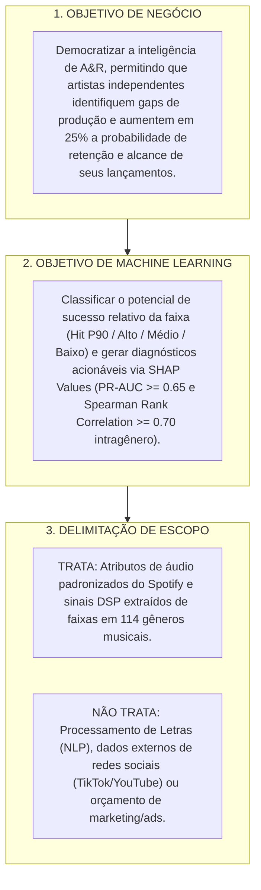

# Relatório Completo do Projeto: HitPredictor & A&R Analytics
## Nano-Challenge: Spotify Data CBL (Challenge Based Learning)

---

## 1. Visão Geral e Contexto do Projeto

O projeto **"HitPredictor & A&R Analytics"** é um copiloto de inteligência de mercado e diagnóstico de produção musical voltado para **artistas independentes, produtores musicais e pequenos selos**.

### Arquivos Integrados no Projeto:
* [`Spotify Nano Challenge.pdf`](file:///home/ingrid/Ingrid/courses/res-ia/grupo02-spotify/Spotify%20Nano%20Challenge.pdf): Proposta conceitual, público-alvo, premissas de negócio e Guiding Questions oficiais.
* [`aula4-investigate-slides_EXTRA.pdf`](file:///home/ingrid/Ingrid/courses/res-ia/grupo02-spotify/aula4-investigate-slides_EXTRA.pdf): Metodologia CBL da fase *Investigate*, definição do Canvas de ML e armadilhas de métricas.
* [`Slides_CBL_Spotify.pptx`](file:///home/ingrid/Ingrid/courses/res-ia/grupo02-spotify/Slides_CBL_Spotify.pptx): Estrutura para a apresentação final e validação de hipóteses.
* [`dataset.csv`](file:///home/ingrid/Ingrid/courses/res-ia/grupo02-spotify/dataset.csv): Base de dados com 114.000 faixas, 114 gêneros únicos e 21 atributos de metadados e áudio.

---

## 2. Canvas da Fase Investigate (CBL)

### Matriz de Priorização das Guiding Questions

| Prioridade | Guiding Question | Atividade (Como responder) | Recurso | Responsável & Prazo |
| :--- | :--- | :--- | :--- | :--- |
| 🔴 **Responder JÁ** | **GQ-1**: Como tratar 24.259 duplicatas entre gêneros e 14% de zeros em `popularity`? | Pipeline de deduplicação por `track_id` e análise de distribuição de zeros. | Pandas, Python | Time de Dados (D+2) |
| 🔴 **Responder JÁ** | **GQ-2**: Qual o limiar estatístico de corte (P90) para cada um dos 114 gêneros? | Cálculo da tabela de percentis agrupada por `track_genre`. | Script Pandas | Time de Dados (D+2) |
| 🟡 **Planejar** | **GQ-3**: Como prever popularidade para artistas sem histórico (*Cold-Start*)? | Treinar modelos baseados em árvores (LightGBM/XGBoost) usando apenas áudio + gênero. | Scikit-Learn / LightGBM | Time de ML (D+6) |
| 🟡 **Planejar** | **GQ-4**: Como gerar diagnósticos acionáveis de mixagem/arranjo? | Implementar SHAP Values (*TreeExplainer*) e cálculo de gaps intragênero. | SHAP, Plotly | Time de ML (D+8) |
| 🟢 **Se sobrar tempo** | **GQ-5**: Modo (Maior/Menor) e Tonalidade influenciam o sucesso por nicho? | Teste de hipótese ANOVA / Chi-quadrado em gêneros selecionados. | Scipy / Statsmodels | Time de Pesquisa (D+10) |
| ✂️ **Cortar** | **GQ-6**: Integrar métricas de YouTube e TikTok? | Descartado por ausência de dados no dataset e foco no ecossistema Spotify. | — | — |

---

## 3. Resolução Estatística das Guiding Questions

### A. Dados e Engenharia de Features

#### GQ1. Análise e normalização das métricas de áudio
* As métricas `danceability`, `energy`, `valence`, `speechiness`, `acousticness`, `instrumentalness` e `liveness` residem no intervalo $[0.0, 1.0]$.
* As métricas `loudness` ($-49.5$ a $+4.5$ dB), `tempo` ($0$ a $243$ BPM) e `duration_ms` necessitam de padronização (*RobustScaler* ou *MinMaxScaler*) para modelos sensíveis à distância.
* `key` (0 a 11) e `mode` (0 ou 1) devem ser tratados como variáveis categóricas ou codificadas ciclicamente.

#### GQ2. EDA e Limpeza dos Dados
* **Valores Faltantes**: Apenas 3 registros nulos pontuais (descarte direto via `dropna()`).
* **Duplicatas de Faixas**: Identificadas **24.259 ocorrências duplicadas de `track_id`** devido à presença da mesma música em múltiplos gêneros. Recomenda-se a deduplicação para o treino global (**89.741 faixas únicas**) e o uso de validação com `StratifiedGroupKFold`.
* **Pico de Popularidade Zero**: **14,05% (16.020 faixas)** possuem `popularity = 0` (músicas fora de catálogo ou sem streaming ativo), exigindo segmentação na modelagem.

#### GQ3. Fatores que influenciam a popularidade
* **a. O Artista influencia?**
  * Sim, apresenta o maior impacto isolado. A variância dentro de um mesmo artista ($\sigma = 8.98$) é menos da metade da variância global ($\sigma = 20.58$).
  * *Decisão de Engenharia*: Para evitar o viés de catálogo e atender artistas novos (*cold-start*), o modelo deve ser treinado com base estritamente em **atributos de áudio + gênero**.
* **b. O Gênero influencia?**
  * Sim. O gênero explica **25,42% de toda a variância da popularidade ($\eta^2 = 0.254$)**.
  * Gêneros de massa (*pop-film* média 59.3, *k-pop* 56.9) possuem patamares muito superiores a gêneros de nicho (*iranian* 2.2, *romance* 3.2). Toda análise deve ser normalizada intragênero.
* **c. A Dançabilidade influencia?**
  * Apresenta comportamento em platô/curva ótima:
    * `danceability < 0.31`: Popularidade média de **27.76** (apenas 16.5% superam pop $\ge 50$).
    * `danceability` entre **0.53 e 0.78**: Popularidade média de **34.45** (mais de 25.5% superam pop $\ge 50$).
* **d. A Duração influencia?**
  * Identificada a **Janela de Ouro do Streaming (2.5 a 4.5 minutos)**:
    * $< 1.5$ min: Média 25.22 (11.5% atingem pop $\ge 50$).
    * **2.5 a 3.5 min**: Média **33.81** (26.5% atingem pop $\ge 50$).
    * **3.5 a 4.5 min**: Média **35.28** (25.9% atingem pop $\ge 50$).
    * $> 10$ min: Média 23.87 (apenas 7.1% atingem pop $\ge 50$).

#### GQ4. Correlação com outras plataformas
* Embora plataformas externas (TikTok/YouTube) sirvam como funil de tração, o escopo foi delimitado às métricas proprietárias do Spotify para garantir reprodutibilidade e confiabilidade com os dados disponíveis.

---

### B. Modelagem e Tomada de Decisão

#### GQ1. Certificação da qualidade da recomendação
* Utilização de **PR-AUC (Precision-Recall AUC)** para avaliar o acerto nos Top 10% Hits.
* Utilização de **Spearman Rank Correlation** e **NDCG@10** para assegurar a ordenação de relevância intragênero.
* Validação de explicabilidade através de **SHAP Values**.

#### GQ2. Estratégia de Treinamento
* Formulação como **Classificação Ordinal/Multi-classe de Potencial**:
  * `Hit Potencial` (Top 10% / $\ge P90$ do gênero)
  * `Alto Desempenho` (P75 a P90)
  * `Médio Desempenho` (P25 a P75)
  * `Baixo Alcance` ($< P25$)
* Treinamento com **LightGBM / XGBoost** sobre as **89.741 faixas únicas**.

#### GQ3. Limiares de Sucesso (P90) por Gênero
* *Pop*: $\ge 82$
* *Rock*: $\ge 79$
* *K-Pop*: $\ge 74$
* *Metal*: $\ge 74$
* *Sertanejo*: $\ge 53$
* *Acoustic*: $\ge 60$
* *Black Metal*: $\ge 41$

---

## 4. Ideias Inovadoras para a Apresentação Final

1. **A&R Radar & Gap Analysis**: Gráfico de radar comparando a faixa do artista independente diretamente contra o centroide dos hits (P90) do gênero.
2. **Hit Potential Index (Z-Score Intragênero)**: Normalização estatística que permite comparar o sucesso de faixas entre gêneros diferentes com justiça de nicho.
3. **Simulador What-If de Produção**: Interface onde o produtor simula ajustes em BPM, duração ou volume e observa o impacto direto na probabilidade de sucesso.
4. **Clustering de Moods Acústicos**: Agrupamento não-supervisionado (K-Means/HDBSCAN) para encontrar nichos sonoros reais além da tag de gênero.

---
*Documento consolidado para a disciplina de Sistemas de Machine Learning.*
