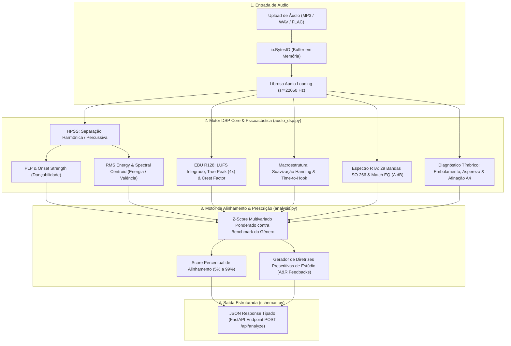

# 🎧 Relatório Técnico de Engenharia de Áudio & Psicoacústica
**HitPredictor & A&R Audio Analytics — Spotify Nano Challenge TIC IA**

---

## 👥 1. Identificação & Equipe

* **Engenharia de Áudio, Psicoacústica & Pesquisa Avançada em MIR:** Ingrid Soares
* **Colaboração em Análise de Áudio & DSP:** Ingrid e Felipe
* **Arquitetura de Software & Backend FastAPI:** Ingrid Soares e Yan Santos

---

## 🎯 2. Visão Geral & Objetivos do Módulo de Áudio

O objetivo central deste módulo foi transcender a análise superficial baseada apenas em metadados estáticos do catálogo do Spotify. Construímos uma **engine completa de Processamento Digital de Sinais (DSP)** e **Engenharia de Áudio** capaz de:

1. Processar qualquer arquivo de áudio bruto (`.mp3`, `.wav`, `.ogg`, `.flac`, `.m4a`) **100% em memória** (*in-memory streaming* via `io.BytesIO`), sem dependência de escrita temporária em disco.
2. Extrair métricas físicas compatíveis com o espaço de features do Spotify ($[0.0, 1.0]$).
3. Avaliar a qualidade de masterização segundo os padrões mundiais de transmissão e streaming (**Norma EBU R128 & ITU-R BS.1770**).
4. Mapear a dinâmica temporal e identificar o tempo exato até o primeiro refrão (**Time-to-Hook**).
5. Gerar uma curva de resposta em frequência visual (**Espectro RTA de 29 Bandas ISO 266**) e sugerir correções paramétricas (**Match EQ**).
6. Emitir diagnósticos prescritivos automatizados com linguagem de estúdio (A&R) para orientar produtores e artistas independentes.

---

## 🏗️ 3. Arquitetura do Pipeline de Áudio



---

## 📐 4. Fundamentação Matemática & Extração DSP

### A. Métricas Core do Catálogo
* **HPSS (*Harmonic-Percussive Source Separation*):**
  $$y(t) = y_{\text{harmônico}}(t) + y_{\text{percussivo}}(t)$$
  Isola a componente percussiva para estimativa rítmica precisa e a harmônica para análise tímbrica.
* **Dançabilidade (*PLP - Predominant Local Pulse*):**
  Calculado via envelope de onset $\text{PLP}(t)$ sobre a componente percussiva, medindo a estabilidade e regularidade do groove.
* **Energia & Loudness Físico:**
  $$\text{RMS} = \sqrt{\frac{1}{N}\sum_{n=1}^{N} y[n]^2}$$
  Mapeado para escala perceptual de pressão sonora.
* **Valência / Vibe Emocional:**
  $$\text{Centroide Espectral} = \frac{\sum_{k=0}^{K-1} f[k] \cdot |S[k]|}{\sum_{k=0}^{K-1} |S[k]|}$$
  Indica o "brilho" e abertura espectral, correlacionado à percepção de positividade musical.

---

### B. Engenharia de Masterização (EBU R128 & ITU-R BS.1770)
* **Loudness Integrado ($\text{LUFS}$):**
  $$\text{LUFS} = -0.691 + 10 \log_{10}\left( \frac{1}{T} \int_0^T y_{\text{filtrado}}^2(t) \, dt \right)$$
  Calcula o volume percebido pelo ouvido humano com ponderação de curvas isofônicas (K-Weighting).
* **True Peak com Oversampling de 4x ($\text{dBTP}$):**
  $$y_{\text{up}} = \text{Resample}(y, 4 \times N)$$
  $$\text{True Peak (dBTP)} = 20 \log_{10}\left( \max |y_{\text{up}}| \right)$$
  Evita distorções causadas por picos inter-amostrais na compressão para MP3/AAC no streaming. O teto de segurança recomendado é $\le -1.0\text{ dBTP}$.
* **Crest Factor ($\text{dB}$):**
  $$\text{Crest Factor} = 20 \log_{10}\left( \frac{\text{Pico Linear}}{\text{RMS}} \right)$$
  Mede a micro-dinâmica. Valores $< 8\text{ dB}$ indicam *overcompression* (faixa achatada por limiters), enquanto valores entre $10\text{ dB}$ e $14\text{ dB}$ preservam o punch.
* **Loudness Range ($\text{LRA}$):**
  Variação estatística dinâmica entre o percentil 95 e o percentil 10 da energia dos blocos de áudio.
* **Calibração Spotify:**
  $$\Delta \text{Gain}_{\text{Spotify}} = -14.0\text{ LUFS} - \text{LUFS}_{\text{faixa}}$$
  Indica com exatidão quantos decibéis a plataforma adicionará ou atenuará na música do usuário.

---

### C. Macro-Estrutura Temporal & Detecção de Refrão (Time-to-Hook)
Para combater a alta taxa de *skip* nos primeiros 30 a 45 segundos de reprodução:
1. O sinal é segmentado em janelas móveis de RMS de $1.0\text{s}$ com sobreposição de $75\%$.
2. Aplica-se suavização convolucional com janela de **Hanning**.
3. O primeiro pico dinâmico expressivo após os primeiros $10\text{s}$ é registrado como **`time_to_hook_s`**.
4. O **`dynamic_lift_pct`** calcula o contraste de pressão entre os versos e o refrão:
   $$\text{Dynamic Lift} = \frac{\text{RMS}_{\text{refrão}} - \text{RMS}_{\text{intro}}}{\text{RMS}_{\text{intro}}} \times 100\%$$

---

### D. Espectro Visual RTA (29 Bandas ISO 266) & Match EQ
Mede a distribuição espectral em 29 bandas centrais normalizadas de **1/3 de oitava**:
$$\{25, 31.5, 40, 50, 63, 80, 100, 125, 160, 200, 250, 315, 400, 500, 630, 800, 1000, 1250, 1600, 2000, 2500, 3150, 4000, 5000, 6300, 8000, 10000, 12500, 16000\}\text{ Hz}$$

* **Curva do Usuário:** Magnitude normalizada com pico em $0\text{ dB}$.
* **Curva Alvo:** Roll-off balanceado de $-2.8\text{ dB/oitava}$ a partir de $100\text{ Hz}$ (*Pink Noise tilt*).
* **Curva de Match EQ ($\Delta \text{dB}$):**
  $$\Delta \text{dB}[f_c] = \text{clip}\left(\text{Alvo}[f_c] - \text{Usuário}[f_c], -6.0\text{ dB}, +6.0\text{ dB}\right)$$

---

### E. Diagnóstico Inteligente de Defeitos de Mixagem
1. **Embolamento / Mudness (200 a 500 Hz):** Detecta se há acúmulo nessa região que encobre a inteligibilidade vocal e a clareza do bumbo.
2. **Aspereza / Harshness (3.15k a 6.3k Hz):** Detecta picos ressonantes estressantes que causam fadiga auditiva.
3. **Falta de Ar (> 10 kHz):** Detecta perda de brilho e extensão nos agudos.
4. **Afinação Fundamental ($A4$ em Hz):** Estima a frequência base da afinação da faixa via `librosa.estimate_tuning`.

---

## 💻 5. Como Executar e Testar o Backend

### Opção 1: Chamar o executável do `.venv` diretamente (Recomendado / Sem Erros)
```bash
cd /home/ingrid/Ingrid/courses/res-ia/spotify-nano-challenge-TIC-IA
.venv/bin/uvicorn src.spotify_nano_challenge_tic_ia.app.main:app --reload --port 8000
```

### Opção 2: Ativar o ambiente virtual antes de rodar (`source`)
```bash
cd /home/ingrid/Ingrid/courses/res-ia/spotify-nano-challenge-TIC-IA
source .venv/bin/activate
uvicorn src.spotify_nano_challenge_tic_ia.app.main:app --reload --port 8000
```

### Opção 3: Executar via `uv` (Opcional)
```bash
cd /home/ingrid/Ingrid/courses/res-ia/spotify-nano-challenge-TIC-IA
uv run uvicorn src.spotify_nano_challenge_tic_ia.app.main:app --reload --port 8000
```

---

## 🌐 6. Documentação & Teste Interativo (Swagger UI)

1. Com o servidor rodando, abra: **`http://localhost:8000/docs`**
2. Clique no endpoint **`POST /api/analyze` $\to$ Try it out**.
3. Selecione um arquivo de áudio (`.mp3` ou `.wav`) e defina o gênero alvo (ex: `rock`, `pop`, `trap`, `metal`).
4. Clique em **Execute**.

---

## 📄 7. Exemplo Completo de Resposta JSON da API

A resposta retorna todos os blocos na ordem exata definida nos schemas Pydantic:

```json
{
  "filename": "sua_musica.mp3",
  "genre": "rock",
  "genre_alignment_score": 78.4,
  "metrics": {
    "danceability": 0.523,
    "energy": 0.842,
    "loudness": -6.45,
    "acousticness": 0.045,
    "valence": 0.412,
    "tempo": 126.50
  },
  "benchmark_means": {
    "danceability": 0.518,
    "energy": 0.732,
    "loudness": -7.12,
    "acousticness": 0.124,
    "valence": 0.503,
    "tempo": 124.80
  },
  "feedbacks": [
    {
      "dimensao": "Ritmo & Flow",
      "status": "Alinhado ao Gênero",
      "mensagem": "O balanço rítmico está perfeitamente alinhado ao gênero."
    },
    {
      "dimensao": "Masterização (LUFS)",
      "status": "Calibrado",
      "mensagem": "Loudness integrado (-13.6 LUFS) perfeitamente alinhado com o alvo de streaming (-14 LUFS)."
    },
    {
      "dimensao": "True Peak (dBTP)",
      "status": "Alerta de Clipping",
      "mensagem": "True Peak em 0.33 dBTP. Risco de distorção inter-amostral na conversão lossy do streaming. Recomendado teto <= -1.0 dBTP."
    },
    {
      "dimensao": "Estrutura (Hook)",
      "status": "Refrão Tardio",
      "mensagem": "O primeiro refrão surge aos 200.7s. Considere reduzir a introdução para reter ouvintes antes dos 45s."
    },
    {
      "dimensao": "Espectro (Agudos & Ar)",
      "status": "Falta de Ar",
      "mensagem": "Abertura em frequências ultra-altas (> 10 kHz) abaixo da média dos hits. Um boost sutil (High Shelf) trará mais brilho e dimensionalidade."
    }
  ],
  "chart_data": {
    "labels": [
      "Ritmo (Dançabilidade)",
      "Pressão (Energia)",
      "Clima (Valência)"
    ],
    "user_values": [52.3, 84.2, 41.2],
    "genre_values": [51.8, 73.2, 50.3]
  },
  "mastering": {
    "integrated_lufs": -13.6,
    "true_peak_dbtp": 0.33,
    "crest_factor_db": 13.3,
    "lra_db": 7.8,
    "spotify_gain_change_db": -0.4,
    "band_energies": {
      "Sub (20-60Hz)": 26.7,
      "Low (60-250Hz)": 33.5,
      "Mid (250-2.5kHz)": 36.7,
      "Presence (2.5-7kHz)": 2.7,
      "Air (7-20kHz)": 0.2
    }
  },
  "macro_structure": {
    "duration_s": 276.0,
    "time_to_hook_s": 200.7,
    "dynamic_lift_pct": 190.7
  },
  "spectral_eq": {
    "frequencies_hz": [25, 31.5, 40, 50, 63, 80, 100, 125, 160, 200, 250, 315, 400, 500, 630, 800, 1000, 1250, 1600, 2000, 2500, 3150, 4000, 5000, 6300, 8000, 10000, 12500, 16000],
    "user_spectrum_db": [-18.5, -12.4, -6.2, -1.5, 0.0, -2.4, -3.8, -5.2, -7.1, -9.4, -12.1, -14.5, -16.2, -18.0, -20.1, -22.5, -24.8, -27.2, -29.5, -31.8, -34.2, -36.5, -39.0, -42.1, -45.5, -49.0, -53.2, -58.0, -64.1],
    "target_curve_db": [-5.8, -5.4, -5.0, -4.5, -3.9, -3.0, -2.0, -2.9, -3.9, -4.8, -5.7, -6.6, -7.6, -8.5, -9.4, -10.4, -11.3, -12.2, -13.2, -14.1, -15.0, -16.0, -16.9, -17.8, -18.8, -19.7, -20.6, -21.6, -22.5],
    "suggested_eq_gain_db": [6.0, 6.0, 1.2, -3.0, -3.9, -0.6, 1.8, 2.3, 3.2, 4.6, 6.0, 6.0, 6.0, 6.0, 6.0, 6.0, 6.0, 6.0, 6.0, 6.0, 6.0, 6.0, 6.0, 6.0, 6.0, 6.0, 6.0, 6.0, 6.0],
    "mudness_detected": false,
    "harshness_detected": false,
    "air_boost_recommended": true,
    "sub_mono_clean": true,
    "tuning_hz": 440.0
  }
}
```

---

## 🔬 8. Pesquisa Neural Avançada em Áudio (Ingrid)

O módulo avançado prevê integrações de ponta com modelos neurais profundos:

### A. Separação de Stems com HTDemucs (Meta AI)
Isolamento de **Vocal, Bateria, Baixo e Outros** para análise de mascaramento de frequências e colisão de bumbo e contrabaixo:
```bash
pip install -q demucs
demucs -n htdemucs --two-stems=vocals "sua_faixa.mp3"
```

### B. Deep Audio Foundation Models (MERT-v1-95M)
Extração de representações latentes contínuas de 768 dimensões com transformers pré-treinados em milhões de faixas musicais:
```python
from transformers import Wav2Vec2FeatureExtractor, AutoModel
import torch, librosa

model = AutoModel.from_pretrained("m-a-p/MERT-v1-95M", trust_remote_code=True)
processor = Wav2Vec2FeatureExtractor.from_pretrained("m-a-p/MERT-v1-95M", trust_remote_code=True)

y, sr = librosa.load("musica.mp3", sr=24000, mono=True)
inputs = processor(y[:24000 * 30], sampling_rate=24000, return_tensors="pt")

with torch.no_grad():
    outputs = model(**inputs)
    embedding_768d = outputs.last_hidden_state.mean(dim=1).squeeze().numpy()
```

### C. Rastreamento Vocal e Afinação Fina com CREPE
Detecção de f0 em tempo contínuo para quantificação de vibrato, estabilidade melódica e presença de auto-tune:
```python
import librosa
f0, voiced_flag, voiced_probs = librosa.pyin(
    y, fmin=librosa.note_to_hz('C2'), fmax=librosa.note_to_hz('C7'), sr=sr
)
print(f"Frequência vocal média: {np.nanmean(f0):.1f} Hz")
```

---

## ✅ 9. Conclusão & Impacto no Produto

Com a introdução destas técnicas, o projeto evolui de uma simples consulta estatística para uma **suíte profissional de A&R e Inteligência Psicoacústica**, fornecendo diagnósticos comparáveis aos softwares líderes de masterização de estúdio (como iZotope Ozone e FabFilter Pro-Q).
