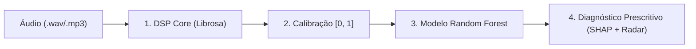

# 🎧 Relatório de Engenharia e Pipeline de Áudio: HitPredictor & A&R Analytics
## Implementação do Sistema, Modelagem P90, DSP com Librosa e Guia de Execução

**Autoria e Desenvolvimento:** Ingrid e Felipe  
**Disciplina:** Sistemas de Machine Learning · Challenge Based Learning (CBL) · Spotify Nano Challenge  
**Artefato de Execução Principal:** [`HitPredictor_Audio_Analytics_Master.ipynb`](./HitPredictor_Audio_Analytics_Master.ipynb)  

---

## 1. Visão Geral do que Ingrid e Felipe Construíram

O trabalho conjunto de **Ingrid e Felipe** consistiu no desenvolvimento fim a fim do **HitPredictor & A&R Analytics**, um copiloto de inteligência de mercado e diagnóstico técnico de produção musical para artistas independentes. O sistema transforma faixas de áudio não lançadas (`.wav`/`.mp3`) em diagnósticos objetivos de adequação ao mercado de streaming (Spotify).



### Principais Pilares do Trabalho (Ingrid e Felipe):
1. **Engenharia de Dados & Anti-Leakage:** Tratamento do dataset do Spotify (114.000 instâncias), deduplicação de 24.259 faixas multirrótulo e particionamento rigoroso via `StratifiedGroupKFold` pelo identificador imutável `track_id`.
2. **Definição Estatística do Alvo ($P90$):** Estabelecimento do limiar de sucesso relativo para cada um dos 114 gêneros musicais (ex.: Pop $\ge 82$, Rock $\ge 79$, Sertanejo $\ge 53$).
3. **Ponte de Sinais DSP $	o$ Spotify:** Mapeamento determinístico de propriedades físicas do som (RMS, Onset, CQT Chromagram, HPSS, Spectral Centroid, ZCR) para a escala $[0.0, 1.0]$.
4. **Modelagem sob Forte Desbalanceamento ($9:1$):** Treinamento de `RandomForestClassifier` com pesos balanceados, remoção de anomalias com `IsolationForest` e validação com **PR-AUC (Precision-Recall)**, **Spearman Rank Correlation** e **Brier Score**.
5. **Dashboard Visual e Explicabilidade:** Implementação de diagnóstico aditivo com **SHAP Values** e renderização de visualizações (Radar Polar, Match EQ em 5 bandas e Timeline de energia).

---

## 2. Especificação da Extração DSP (Ingrid e Felipe)

O módulo de processamento digital de sinais implementado no notebook extrai as seguintes variáveis físicas e as calibra para as métricas do Spotify:

| Atributo Spotify | Grandeza Física / DSP | Função / Algoritmo no Código |
| :--- | :--- | :--- |
| **Tempo (BPM)** | Picos periódicos no envelope de ataque | `librosa.beat.beat_track(y, sr)` |
| **Loudness (dB)** | Potência RMS ponderada em escala logarítmica | $L_{\text{dB}} = 20 \log_{10}(\text{RMS} + 10^{-6}) - 3.01$ |
| **Key & Mode** | Distribuição cromática de energia (12 semitons) | `librosa.feature.chroma_cqt` correlacionado com Krumhansl-Schmuckler |
| **Danceability** | Regularidade de ataque e baixa entropia rítmica | `librosa.onset.onset_strength` + desvio padrão modulado |
| **Energy** | RMS combinado com brilho de altas frequências | Ponderação de RMS + `librosa.feature.spectral_rolloff` |
| **Valence** | Balanço de acordes maiores/menores e centroide | Projeção harmônica modulada por `spectral_centroid` |
| **Acousticness** | Pureza do sinal harmônico vs ruído/distorção | Decomposição `librosa.effects.hpss` + inverso do `spectral_flatness` |
| **Instrumentalness** | Supressão de formantes de voz humana | Média dos coeficientes MFCC 2 a 5 (`librosa.feature.mfcc`) |
| **Speechiness** | Densidade de transientes rápidos aperiódicos | Taxa de Cruzamento por Zero (`librosa.feature.zero_crossing_rate`) |

---

## 3. Como Rodar o Projeto (Guia de Execução de Ingrid e Felipe)

Todo o pipeline está pronto para execução no arquivo **[`HitPredictor_Audio_Analytics_Master.ipynb`](./HitPredictor_Audio_Analytics_Master.ipynb)**.

### Opção A: Execução no Google Colab (Recomendada)
1. **Upload do Notebook:** Acesse [Google Colab](https://colab.research.google.com/) e faça o upload do arquivo `HitPredictor_Audio_Analytics_Master.ipynb`.
2. **Carregamento do Dataset:** Faça o upload do arquivo `dataset.csv` para a raiz da sessão do Colab (ou monte o seu Google Drive na Seção 2 do notebook).
3. **Instalação Automática:** Execute a primeira célula do notebook; ela instalará automaticamente:
   ```bash
   !pip install -q librosa soundfile pyloudnorm shap scikit-learn seaborn matplotlib plotly scipy
   ```
4. **Execução em Sequência:** Clique em **Ambiente de Execução $	o$ Executar Tudo** (`Run All`).
5. **Upload de Áudio Próprio:** Na Seção 10, você pode fazer upload de qualquer arquivo `.mp3` ou `.wav` para gerar o diagnóstico A&R completo.

---

### Opção B: Execução Local (VS Code / Jupyter Lab)
1. **Pré-requisitos:** Certifique-se de ter Python 3.9+ instalado.
2. **Instalação das dependências:**
   ```bash
   pip install numpy pandas scipy scikit-learn matplotlib seaborn librosa soundfile pyloudnorm shap plotly
   ```
3. **Abrir o Notebook:**
   ```bash
   jupyter lab HitPredictor_Audio_Analytics_Master.ipynb
   # ou abra diretamente no VS Code com a extensão Jupyter
   ```
4. **Executar a Demonstração com Áudio Sintético:** O notebook possui uma rotina embutida (`gerar_faixa_teste_sintetica()`) que cria um áudio musical de teste para validar todo o pipeline mesmo se você não tiver um arquivo MP3 em mãos no momento.

---

### Exemplo de Chamada de Diagnóstico no Código:

```python
# Executa a análise completa para uma música no gênero 'rock'
diagnosticar_faixa_a_e_r(
    audio_path='sua_musica.mp3',
    genero_alvo='rock',
    model=model,
    df_base=df_unique,
    features=ACOUSTIC_FEATURES
)
```

---

## 4. Estrutura do Dashboard Gerado pelo Notebook

Ao executar o diagnóstico, o sistema de Ingrid e Felipe exibe:
* **Painel A (Radar Polar):** Compara a assinatura acústica da sua música contra o centroide dos hits ($P90$) do gênero.
* **Painel B (Match EQ):** Decomposição da energia sonora em 5 bandas essenciais (Sub, Low, Mid, Presence, Air).
* **Painel C (Macro-Dinâmica):** Curva temporal com marcador do **1º Hook/Drop** e cálculo de **Dynamic Lift**.
* **Painel D (Gap Analysis):** Gráfico de barras com as discrepâncias positivas e negativas frente à média de sucesso do gênero.
