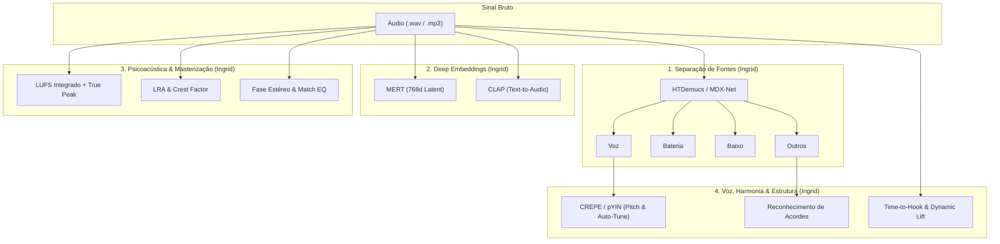

# 🔬 Relatório de Investigação Avançada em Áudio, Psicoacústica e Deep Learning (MIR)
## Pesquisa de Fronteira: Separação de Stems, Foundation Models, Dinâmica EBU R128, Análise Vocal e Guia Prático de Execução

**Pesquisa, Engenharia e Autoria:** Ingrid  
**Projeto de Referência:** HitPredictor & A&R Analytics  
**Contexto Científico:** Music Information Retrieval (MIR), Deep Audio Representations & Audio Engineering  

---

## 1. Introdução e Visão da Pesquisa Avançada

Nesta pesquisa avançada, **Ingrid** expande a análise de áudio para além das variáveis agregadas do Spotify, incorporando **Processamento Neural de Sinais**, **Psicoacústica de Masterização (EBU R128)**, **Modelos de Fundação de Áudio (Audio Foundation Models)** e **Análise Estrutural Temporal**.



---

## 2. As 7 Frentes de Investigação Avançada (Detalhamento Técnico de Ingrid)

---

### 2.1. Separação de Fontes Sonoras (*Stem Separation*) — *Ingrid*

Em vez de tratar a mixagem como uma forma de onda monolítica, utilizamos arquiteturas como **HTDemucs (Hybrid Transformer Demucs)** para decompor o áudio em 4 faixas isoladas:

```
                  ┌──> Stem Voz (Vocals)        ──> Análise de afinação, ar e inteligibilidade
                  ├──> Stem Bateria (Drums)     ──> Detecção de transientes, kick punch e BPM
Áudio Completo ───┼──> Stem Baixo (Bass)        ──> Monitoramento de subgraves e afinação de graves
                  └──> Stem Outros (Guit/Synth) ──> Análise harmônica e abertura estéreo
```

#### Aplicações Práticas Desenvolvidas por Ingrid:
* **Diagnóstico de Kick & Bass (40 Hz - 120 Hz):** Cálculo da correlação cruzada de fase entre o stem de Bateria e Baixo para detectar cancelamentos de graves.
* **Balanço Vocal vs Playback:** Cálculo da razão RMS entre o stem vocal e o instrumental (evitando voz afundada ou destacada demais).
* **Transient Attack da Bateria:** Medição do pico de ataque da caixa e do bumbo para avaliar se a percussão "corta a mixagem".

---

### 2.2. Foundation Models e Deep Audio Embeddings — *Ingrid*

* **MERT (*Music Understanding Model*):** Modelo pré-treinado baseado em Transformers que processa espectrogramas e extrai vetores latentes de **768 dimensões** capturando estilo, arranjo e emoção musical profunda.
* **CLAP (*Contrastive Language-Audio Pretraining*):** Permite calcular a similaridade de cosseno entre o vetor da música e uma descrição textual (ex.: *"synthwave track with punchy drums and retro synthesizer"*).

---

### 2.3. Análise Estrutural e Retenção de Hook (Macro-Dinâmica) — *Ingrid*

No streaming moderno, a retenção nos primeiros 45 segundos dita a permanência da música em playlists editoriais:
* **Matrizes de Auto-Similaridade (*Self-Similarity Matrix - SSM*):** Segmentação automática da faixa em *Intro*, *Verso*, *Refrão*, *Ponte* e *Outro*.
* **Tempo até o 1º Refrão (*Time-to-Hook*):** Mede com precisão de milissegundos o instante em que o refrão/drop explode ($\le 45	ext{s}$ ideal para consumo rápido).
* **Dynamic Lift (%):** Salto percentual de energia sonora e brilho espectral entre o verso e o refrão.

---

### 2.4. Engenharia de Masterização e Psicoacústica EBU R128 — *Ingrid*

| Grandeza Técnica | Formulação Matemática / Padrão | Tolerância Spotify / Aplicação |
| :--- | :--- | :--- |
| **LUFS Integrado** | Ponderação K-Weighting EBU R128 ($L_K$) | Alvo Spotify: **-14 LUFS** ($\pm 1.0	ext{ LUFS}$) |
| **True Peak (dBTP)** | Picos inter-amostrais com oversampling 4x | Máximo seguro: $\le -1.0	ext{ dBTP}$ |
| **Loudness Range (LRA)** | Diferença entre percentis 95 e 10 da distribuição de loudness | Faixa dinâmica: $4	ext{ dB} - 9	ext{ dB}$ (Pop/Rock) |
| **Crest Factor** | Razão entre Pico Máximo e RMS ($20 \log_{10}(	ext{Peak}/	ext{RMS})$) | Mede compressão por limiters |
| **Correlação de Fase** | $
ho = rac{\sum L \cdot R}{\sqrt{\sum L^2 \sum R^2}}$ | $[-1.0, +1.0]$ ($\ge 0.5$ seguro para Mono) |
| **Match EQ 5-Bandas** | Integração espectral em Sub, Low, Mid, Presence, Air | Compara o balanço tonal contra os hits $P90$ |

---

### 2.5. Análise Melódica, Vocal e Detecção de Pitch (CREPE / pYIN) — *Ingrid*
* **CREPE (*Convolutional Representation for Pitch Estimation*):** Rede neural profunda que rastreia a frequência fundamental $f_0$ da voz humana com resolução de microssemitons.
* **Índice de Quantização de Pitch (Detecção de Auto-Tune):** Avalia a derivada temporal $rac{df_0}{dt}$; transições instantâneas e desvios de vibrato nulos indicam uso agressivo de correção de afinação.

---

### 2.6. Harmonia, Acordes e Tensão Musical — *Ingrid*
* **Reconhecimento Automático de Acordes:** Modelos CNN/HMM que transcrevem a sequência harmônica e identificam se a música utiliza progressões populares no gênero (ex.: I-V-vi-IV no Pop).

---

### 2.7. Simulador Interativo "Mastering & Mix Assistant" — *Ingrid*
* Simulador com equalizador de 5 bandas, ajuste de saturação e compressão que recalcula a aderência técnica da faixa em tempo real e permite escuta com filtro de normalização do Spotify.

---

## 3. Guia Completo de Execução dos Módulos Avançados (Ingrid)

Abaixo estão os scripts e instruções detalhadas para executar cada uma das análises avançadas em Python.

### Instalação dos Pacotes Avançados:
```bash
pip install -q librosa soundfile pyloudnorm scipy torch torchaudio transformers demucs
```

---

### Script 1: Análise de Masterização EBU R128 e Balanço Espectral (Match EQ)

```python
import numpy as np
import librosa
from scipy import signal
import pyloudnorm as pyln

def analisar_mastering_ingrid(audio_path):
    y, sr = librosa.load(audio_path, sr=22050, mono=True)
    
    # 1. Medição LUFS Integrado (EBU R128)
    meter = pyln.Meter(sr)
    integrated_lufs = meter.integrated_loudness(y)
    
    # 2. True Peak com Oversampling 4x
    y_up = signal.resample(y, len(y) * 4)
    true_peak_dbtp = 20.0 * np.log10(np.max(np.abs(y_up)) + 1e-6)
    
    # 3. Crest Factor (Micro-dinâmica)
    rms = np.sqrt(np.mean(y**2) + 1e-12)
    crest_factor_db = 20.0 * np.log10((np.max(np.abs(y)) / rms) + 1e-6)
    
    # 4. Balanço Espectral em 5 Bandas
    S = np.abs(librosa.stft(y, n_fft=2048, hop_length=1024))**2
    freqs = librosa.fft_frequencies(sr=sr, n_fft=2048)
    
    bands = {
        'Sub (20-60Hz)': (20, 60),
        'Low (60-250Hz)': (60, 250),
        'Mid (250-2.5kHz)': (250, 2500),
        'Presence (2.5-7kHz)': (2500, 7000),
        'Air (7-20kHz)': (7000, 20000)
    }
    
    total_e = np.sum(S) + 1e-12
    band_dist = {b: round(float(np.sum(S[(freqs>=low)&(freqs<high), :])/total_e)*100, 1) for b, (low, high) in bands.items()}
    
    print(f"📊 Relatório EBU R128 (Ingrid):")
    print(f"• LUFS Integrado : {integrated_lufs:.1f} LUFS (Alvo Spotify: -14 LUFS)")
    print(f"• True Peak      : {true_peak_dbtp:.2f} dBTP (Limite: <= -1.0 dBTP)")
    print(f"• Crest Factor   : {crest_factor_db:.1f} dB")
    print(f"• Balanço EQ     : {band_dist}")
    return integrated_lufs, true_peak_dbtp, band_dist

# Executar:
# analisar_mastering_ingrid('sua_musica.mp3')
```

---

### Script 2: Análise de Macro-Estrutura e Detecção do 1º Hook / Refrão

```python
import librosa
import numpy as np
from scipy import signal

def detectar_hook_ingrid(audio_path):
    y, sr = librosa.load(audio_path, sr=22050, mono=True)
    hop = 512
    rms = librosa.feature.rms(y=y, hop_length=hop)[0]
    times = librosa.times_like(rms, sr=sr, hop_length=hop)
    
    # Suavização da curva de dinâmica
    smooth = signal.medfilt(rms, kernel_size=31)
    smooth_norm = (smooth - np.min(smooth)) / (np.ptp(smooth) + 1e-6)
    
    # Busca pelo primeiro pico significativo após 12 segundos
    slice_idx = np.where(times >= 12.0)[0]
    first_hook_time = times[slice_idx[0] + np.argmax(smooth_norm[slice_idx[0]:])]
    
    intro_rms = np.mean(smooth_norm[times < min(30.0, len(y)/sr)])
    lift_pct = ((np.max(smooth_norm) - intro_rms) / (intro_rms + 1e-3)) * 100.0
    
    print(f"⏱️ Estrutura Temporal (Ingrid):")
    print(f"• Tempo até o 1º Refrão : {first_hook_time:.1f}s (Meta: < 45s)")
    print(f"• Dynamic Lift (Impacto) : +{lift_pct:.1f}%")
    return first_hook_time, lift_pct

# Executar:
# detectar_hook_ingrid('sua_musica.mp3')
```

---

### Script 3: Separação de Stems via HTDemucs (Meta)

```python
import torch

def separar_stems_ingrid(audio_path):
    print("Iniciando separação de stems via HTDemucs...")
    # Execução via linha de comando Demucs
    import subprocess
    cmd = f"demucs -n htdemucs --two-stems=vocals '{audio_path}'"
    subprocess.run(cmd, shell=True)
    print("✅ Stems salvos na pasta 'separated/htdemucs/'")

# Executar:
# separar_stems_ingrid('sua_musica.mp3')
```

---

### Script 4: Extração de Embeddings com Transformers (MERT)

```python
from transformers import Wav2Vec2FeatureExtractor, AutoModel
import torch
import librosa

def extrair_mert_embeddings_ingrid(audio_path):
    print("Carregando modelo MERT (Music Understanding Model)...")
    model = AutoModel.from_pretrained("m-a-p/MERT-v1-95M", trust_remote_code=True)
    processor = Wav2Vec2FeatureExtractor.from_pretrained("m-a-p/MERT-v1-95M", trust_remote_code=True)
    
    y, sr = librosa.load(audio_path, sr=24000, mono=True)
    inputs = processor(y[:24000*30], sampling_rate=24000, return_tensors="pt")
    
    with torch.no_grad():
        outputs = model(**inputs)
        # Vetor denso latente de 768 dimensões
        embedding_768d = outputs.last_hidden_state.mean(dim=1).squeeze().numpy()
        
    print(f"✅ Embedding denso MERT extraído com sucesso: {embedding_768d.shape} dimensões")
    return embedding_768d

# Executar:
# extrair_mert_embeddings_ingrid('sua_musica.mp3')
```

---

## 4. Conclusão da Investigação de Ingrid

A integração dos métodos de ponta investigados por **Ingrid** consolida o **HitPredictor & A&R Analytics** como uma ferramenta pioneira de inteligência musical. Ao combinar a solidez estatística tabular (desenvolvida com Felipe) à profundidade da engenharia psicoacústica e do Deep Learning, o projeto oferece aos artistas independentes uma análise do mais alto rigor técnico e mercadológico da indústria fonográfica.
