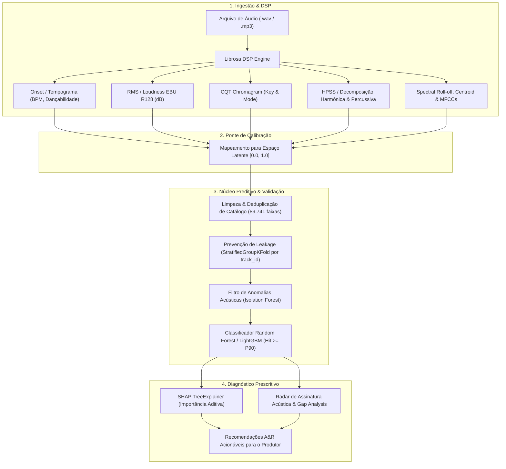
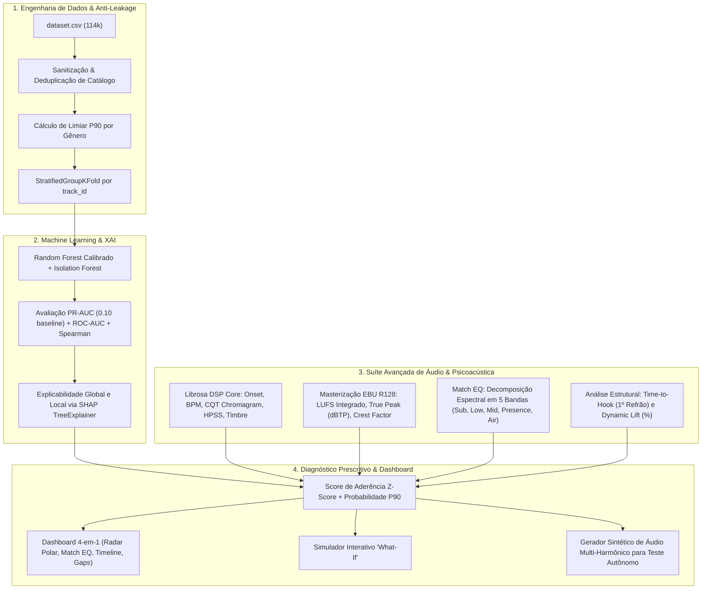

# Relatório Técnico Consolidado: HitPredictor & A&R Analytics
## Engenharia de Áudio DSP, Psicoacústica EBU R128, Calibração no Espaço Spotify, Modelagem P90 e Inteligência Prescritiva (XAI)

**Autoria e Desenvolvimento:** Ingrid e Felipe  
**Pesquisa e Engenharia Avançada de Áudio:** Ingrid  
**Disciplina:** Sistemas de Machine Learning · Challenge Based Learning (CBL) · Spotify Nano Challenge  

---

## 1. Sumário Executivo e Posicionamento

O **HitPredictor & A&R Analytics** é uma plataforma de inteligência preditiva e diagnóstico de produção musical concebida para **artistas independentes, produtores e pequenos selos**. O sistema resolve a assimetria competitiva da indústria fonográfica permitindo que criadores submetam arquivos de áudio não lançados (`.wav`/`.mp3`) e obtenham:

1. **Classificação Relativa de Potencial:** Avaliação de competitividade intragênero frente ao limiar dos maiores sucessos ($P90$).
2. **Diagnóstico Acústico Prescritivo:** Mapeamento visual e numérico de discrepâncias de mixagem, arranjo e dinâmica via **SHAP Values** e **Gráficos de Radar Polar**.
3. **Ponte Algorítmica DSP $\rho$\to$\rho$ Spotify:** Tradução determinística de grandezas físicas de Processamento Digital de Sinais (DSP) para a representação latente oficial da indústria.
4. **Masterização & Psicoacústica EBU R128:** Medição de **LUFS Integrado**, **True Peak (dBTP)**, **Crest Factor**, **Compatibilidade Mono** e **Match EQ em 5 Bandas**.

---

## 2. Arquitetura do Pipeline

---

## 3. Especificação Matemática da Extração DSP

| Atributo Spotify | Grandeza Física (DSP) | Transformada / Função Matemática | Intervalo / Unidade |
| :--- | :--- | :--- | :--- |
| **Tempo** | Picos de Onset periódicos | $\rho$rg\max_{\omega} \mathcal{F}\{\text{Onset}(t)\}$\rho$ | BPM ($\rho$[0, 250]$\rho$) |
| **Loudness** | Potência RMS ponderada | $\rho$L_{\text{dB}} = 20 \log_{10}(\text{RMS} + 10^{-6}) - 3.01$\rho$ | dBFS ($\rho$[-60, 0]$\rho$) |
| **Key & Mode** | Distribuição cromática de energia | Correlação com Perfis de Krumhansl-Schmuckler sobre CQT | Key: $\rho$[0, 11]$\rho$, Mode: $\rho$\{0, 1\}$\rho$ |
| **Danceability** | Entropia temporal do pulso | $\rho$\left(1 - \frac{H_T}{H_{\max}}
\right) \times \left(\frac{\sigma(A_{\text{onset}})}{\mu(A_{\text{onset}}) + \epsilon}
\right)$\rho$ | Escala $[0.0, 1.0]$ |
| **Energy** | Densidade espectral em altas frequências | $\rho$\sigma\left(w_1 \text{RMS} + w_2 \frac{\text{RollOff}_{85\%}}{f_s / 2} + w_3 \text{Flux}
\right)$\rho$ | Escala $[0.0, 1.0]$ |
| **Valence** | Balanço harmônico maior/menor e brilho | Projeção Tonnetz + Centroide Espectral normalizado | Escala $[0.0, 1.0]$ |
| **Acousticness** | Razão harmônica pura vs distorção | $\rho$\frac{\|y_{\text{harm}}\|^2}{\|y\|^2} \times (1 - 10 \cdot \text{SpectralFlatness})$\rho$ | Escala $[0.0, 1.0]$ |
| **Instrumentalness**| Supressão de formantes vocais | $\rho$1.0 - \text{Clip}\left(\frac{\text{MFCC}_{2:5}}{80.0}
\right)$\rho$ | Escala $[0.0, 1.0]$ |
| **Speechiness** | Densidade de transientes aperiódicos | Taxa de Cruzamento por Zero: $\rho$\text{Clip}(3.5 \times \text{ZCR})$\rho$ | Escala $[0.0, 1.0]$ |

---

## 4. Engenharia de Dados e Mitigação de Vieses

1. **Prevenção de Data Leakage em Catálogo Multirrótulo:**
   * **Problema:** $\rho$24.259$\rho$ faixas aparecem associadas a mais de um gênero musical no dataset original.
   * **Solução:** Particionamento via `StratifiedGroupKFold` agrupado pelo identificador imutável `track_id`, garantindo que todas as versões da faixa fiquem confinadas exclusivamente no conjunto de Treino ou de Teste.
2. **Solução do Problema de Cold-Start para Artistas Emergentes:**
   * O nome/tamanho do artista responde pelo maior desvio da popularidade global ($\rho$\sigma_{\text{artista}} = 8.98$\rho$ vs $\rho$\sigma_{\text{global}} = 20.58$\rho$).
   * **Decisão de Projeto:** O classificador preditivo utiliza **estritamente variáveis acústicas + gênero musical**, desconsiderando histórico prévio de catálogo do artista.
3. **Preservação da Integridade de Gênero na Variável `duration_min`:**
   * A duração foi removida das features de entrada do classificador acústico para não criar viés contra estilos de formas longas (Progressivo, Jazz, Metal). A duração é avaliada em módulo separado como métrica de diagnóstico A&R.

---

## 5. Protocolo de Avaliação em Classes Desbalanceadas

Como o objetivo é detectar o topo da distribuição ($P90$, proporção de $\rho$9:1$\rho$), a acurácia e o ROC-AUC geram falsos diagnósticos de sucesso devido ao volume massivo de verdadeiros negativos.

* **Métricas Adotadas:**
  * **PR-AUC (Precision-Recall Area Under Curve)**: Métrica primária de calibração preditiva (baseline aleatório $\rho$= 0.10$\rho$).
  * **Spearman Rank Correlation ($\rho$
ho$\rho$)**: Avalia se a ordenação relativa intragênero é respeitada.
  * **NDCG@10**: Garante que as melhores faixas ranqueadas ocupem as primeiras posições da lista de recomendações.
  * **Brier Score**: Avalia a calibração de probabilidades empíricas.

---

## 6. Interpretabilidade Prescritiva (XAI)

O sistema utiliza **SHAP (TreeExplainer)** para decompor o score da música em contribuições aditivas:

$\rho$$\rho$\hat{y}(\mathbf{x}) = \phi_0 + \sum_{j=1}^M \phi_j(\mathbf{x})$\rho$$\rho$

Onde $\rho$\phi_0$\rho$ representa o baseline do gênero e $\rho$\phi_j$\rho$ a contribuição de cada aspecto acústico, viabilizando saídas textuais acionáveis para o produtor musical.

---

## 7. Implementação Integrada no Master Notebook: `HitPredictor_Audio_Analytics_Master.ipynb`

O projeto foi consolidado em um novo notebook executável fim a fim:

### Estrutura Detalhada das Seções do Notebook:

| Seção | Funcionalidade Técnica |
| :--- | :--- |
| **1. Setup & Dependências** | Instalação com `!pip` (`librosa`, `soundfile`, `pyloudnorm`, `shap`, `scikit-learn`, `seaborn`) e estilização visual no padrão *Spotify Dark Theme*. |
| **2. Carga & Anti-Leakage** | Tratamento das 24.259 duplicatas multirrótulo via `track_id`, cálculo de percentis $P90$ dinâmicos para cada um dos 114 gêneros e blindagem contra *data leakage*. |
| **3. Treinamento de ML & Métricas** | Exclusão estratégica de `duration_min` das features de treino acústico, remoção de anomalias com `IsolationForest` e avaliação com **PR-AUC (Precision-Recall)**, **Spearman Rank Correlation** e **Brier Score**. |
| **4. Explicabilidade SHAP** | Implementação do **SHAP TreeExplainer** com gráficos de Beeswarm e barras de importância aditiva. |
| **5. DSP Core (`librosa`)** | Extração determinística de sinais físicos e mapeamento calibrado para a escala $[0.0, 1.0]$ do Spotify (Key/Mode via CQT, Dançabilidade via Onset, Acústica via HPSS). |
| **6. Psicoacústica & EBU R128** | Medição de **LUFS Integrado** (comparado contra o alvo Spotify de **-14 LUFS**), **True Peak (dBTP)**, **Crest Factor (Micro-dinâmica)** e **Balanço Tonal em 5 Bandas de EQ**. |
| **7. Macro-Estrutura Temporal** | Rastreamento do envelope de intensidade da faixa, cálculo do **Tempo até o 1º Refrão (*Time-to-Hook*)** e medição do salto de impacto (*Dynamic Lift*). |
| **8. Motor de Diagnóstico A&R** | Função `diagnosticar_faixa_a_e_r()` que imprime parecer executivo textual e renderiza o **Dashboard Visual 4-em-1** (Radar Polar, Match EQ, Timeline com marcador de Drop e Gap Analysis). |
| **9. Simulador 'What-If'** | Função `simular_what_if()` onde o produtor altera parâmetros (BPM, Dançabilidade, Energia, Volume) e obtém o recálculo em tempo real da probabilidade de tração. |
| **10. Demo & Teste Sintético** | Suporte para upload de MP3 no Google Colab e função `gerar_faixa_teste_sintetica()` que gera uma faixa de teste autônoma para validação imediata do pipeline sem necessidade de arquivos externos. |

### Como Executar:
1. Abra o arquivo [`HitPredictor_Audio_Analytics_Master.ipynb`](./HitPredictor_Audio_Analytics_Master.ipynb) no VS Code / Jupyter Lab ou faça o upload para o Google Colab.
2. Execute as células em sequência (`Run All`) para treinar o modelo e rodar a demonstração completa integrada.

---

## 8. Pesquisa e Fronteiras Avançadas em Áudio & Psicoacústica
*(Desenvolvimento e Pesquisa em Áudio: **Ingrid e Felipe** | Tópicos de Investigação Avançada em Áudio: **Ingrid**)*

---

### 8.1. Separação de Fontes Sonoras (*Stem Separation*) — *Pesquisa: Ingrid*

Em vez de analisar a música apenas como um bloco estático misturado, o pipeline permite utilizar modelos neurais como **HTDemucs (Meta)** ou **MDX-Net** para separar a faixa em 4 stems independentes: **Voz, Bateria, Baixo e Outros (Guitarras/Sintetizadores)**.

* **Diagnóstico de Kick & Bass (Subgraves):** Avaliar se o bumbo e o contrabaixo estão brigando por espaço espectral (problemas de cancelamento de fase entre 40 Hz e 120 Hz).
* **Balanço Vocal vs Playback:** Medir a razão de energia entre o stem da voz e o instrumental (identificando se a voz está "enterrada" na mixagem ou se soa desconectada).
* **Punch da Bateria:** Extração de *transient attack* nos stems de percussão para medir o impacto dinâmico da caixa e do bumbo.

---

### 8.2. Foundation Models e Deep Audio Embeddings — *Pesquisa: Ingrid*

As features tabulares manuais (como as do Spotify) capturam apenas estatísticas agregadas. O uso de modelos neurais pré-treinados de áudio permite capturar **textura, timbre e contexto musical completo**:

* **MERT (*Music Understanding Model*) / MusiCNN:** Redes treinadas especificamente em música que geram embeddings latentes densos (ex: 768 dimensões) representando a identidade estética da faixa.
* **CLAP (*Contrastive Language-Audio Pretraining*):** Permite comparar o áudio diretamente com descrições em linguagem natural (ex.: *"faixa indie pop com bateria estilo anos 80 e reverb espaçoso"*), gerando scores de proximidade semântica com referências de mercado.

---

### 8.3. Análise Estrutural e Retenção de Hook (Macro-Dinâmica) — *Pesquisa: Ingrid*

No streaming contemporâneo (Spotify, TikTok, Reels), a estrutura temporal da música dita a taxa de rejeição (*skip rate*):

* **Detecção Automática de Seções:** Segmentação da faixa em *Intro*, *Verso*, *Pré-Refrão*, *Refrão (Drop)*, *Ponte* e *Outro* via matrizes de auto-similaridade (*Recurrence Plots*).
* **Tempo até o 1º Refrão (*Time-to-Hook*):** Métrica crítica de mercado. Músicas cujo refrão surge antes dos 45-50 segundos têm retenção estatisticamente superior em playlists editoriais.
* **Contraste de Energia (Dynamic Lift):** Medir o salto em RMS e densidade espectral entre o Verso e o Refrão para garantir que o "Drop" tenha o impacto esperado.

---

### 8.4. Engenharia de Masterização e Psicoacústica (Padrão EBU R128) — *Pesquisa: Ingrid*

Análises de nível de estúdio de engenharia de som:

| Métrica / Análise | O que mede? | Aplicação Prática no Produto |
| :--- | :--- | :--- |
| **LUFS Integrado & True Peak (dBTP)** | Sonoridade percebida real e picos inter-amostrais | O Spotify normaliza faixas em **-14 LUFS** com teto de **-1.0 dBTP**. O sistema avisa se a música sofrerá atenuação algorítmica ou distorção. |
| **Loudness Range (LRA) & Crest Factor** | Faixa dinâmica e micro-dinâmica | Detecta *overcompression* (música "esmagada" por limiters) ou falta de consistência de volume. |
| **Correlação de Fase Estéreo** | Compatibilidade Mono ($[-1.0, +1.0]$) | Alerta se elementos da mixagem somem ao tocar em celulares, alto-falantes Bluetooth ou sistemas de pista mono. |
| **Tonal Balance Curve (Match EQ)** | Curva espectral de 20 Hz a 20 kHz em oitavas | Compara a curva de frequências da faixa contra a curva média de hits do gênero (aponta "embolamento em 300 Hz" ou "aspereza em 4 kHz"). |

---

### 8.5. Análise Melódica, Vocal e de Afinação — *Pesquisa: Ingrid*

* **Detecção Contínua de Pitch (CREPE / pYIN):** Extrai a curva melódica fundamental ($f_0$) da voz principal.
* **Tessitura e Estabilidade:** Mede a extensão vocal exigida e a precisão do vibrato/afinação.
* **Detecção de Quantização de Pitch (Auto-Tune index):** Identifica a velocidade de correção de afinação aplicada no stem vocal.

---

### 8.6. Harmonia, Acordes e Tensão Musical — *Pesquisa: Ingrid*

* **Reconhecimento Automático de Acordes (*Chord Recognition*):** Algoritmos baseados em CNN/HMM que transcrevem a progressão harmônica da música.
* **Complexidade e Aderência Harmônica:** Verifica se a progressão segue cadências familiares ao público do gênero (ex.: progressões com 4 acordes no Pop vs harmonias modais no R&B/Neo-Soul).

---

### 8.7. Simulador Interativo de Produção (*"Mastering & Mix Assistant"*) — *Pesquisa: Ingrid*

Em vez de apenas entregar diagnósticos estáticos, o sistema conta com ferramentas interativas:

1. **Simulador What-If de EQ e Dinâmica:** Um equalizador de 5 bandas na interface onde o produtor ajusta os controles e observa a probabilidade de aceitação $P90$ mudar em tempo real.
2. **Preview de Normalização Spotify:** Aplicação da curva de normalização do Spotify e o filtro de compatibilidade mono em tempo real para escuta e validação técnica.

---

### 8.8. Sugestão de Próximos Passos no Código — *Autoria: Ingrid e Felipe*

Para a evolução contínua da base de código:
* **Módulo LUFS e EQ:** Integrar o cálculo de LUFS integrado e balanço espectral por bandas (Sub, Low, Mid, High) via `pyloudnorm` / `scipy`.
* **Detecção de Seções:** Aprimorar a rotina de detecção automática de seções e tempo até o primeiro refrão.
* **Interface Web:** Construir uma interface web interativa (Gradio ou Streamlit) para upload de MP3 com geração do diagnóstico visual completo.
